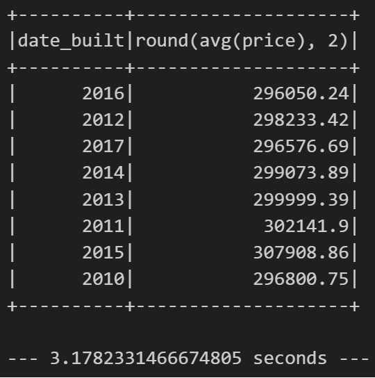
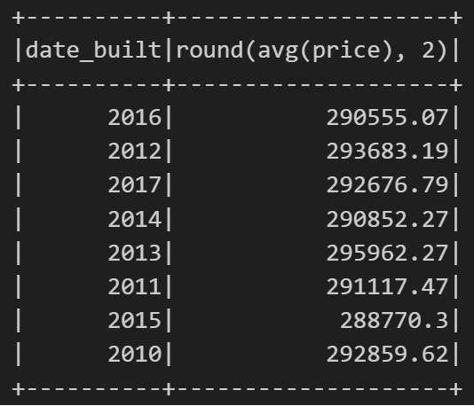
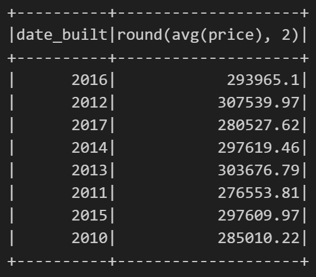
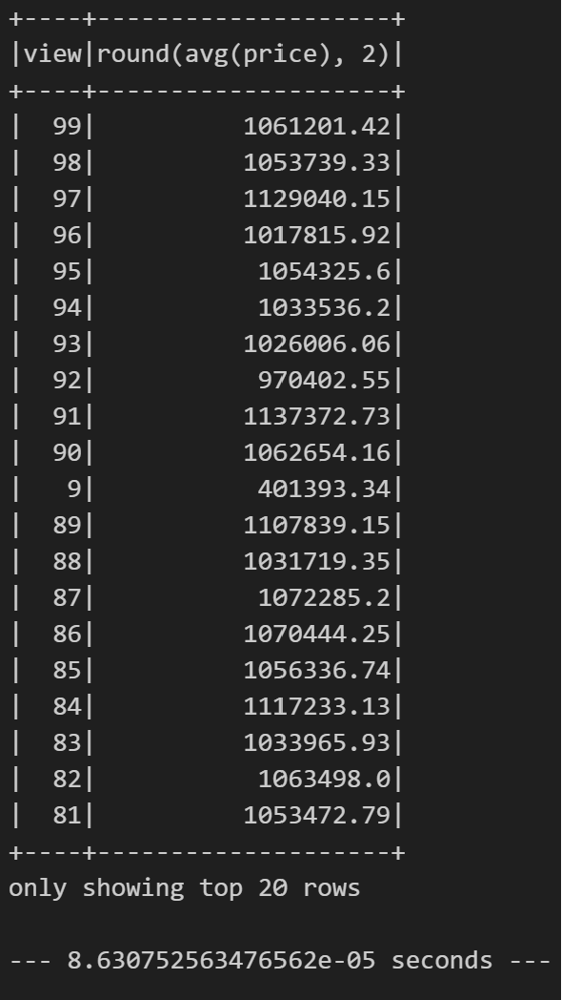

# Home_Sales

## Questions to Answer
*What is the average price for a four-bedroom house sold for each year? Round off your answer to two decimal places.
    * 
*What is the average price of a home for each year it was built that has three bedrooms and three bathrooms? Round off your answer to two decimal places.
    * 
*What is the average price of a home for each year that has three bedrooms, three bathrooms, two floors, and is greater than or equal to 2,000 square feet? Round off your answer to two decimal places.
    * 
*What is the "view" rating for homes costing more than or equal to $350,000? Determine the run time for this query, and round off your answer to two decimal places.
    * 

# References
Data for this dataset was generated by edX Boot Camps LLC, and is intended for educational purposes only.